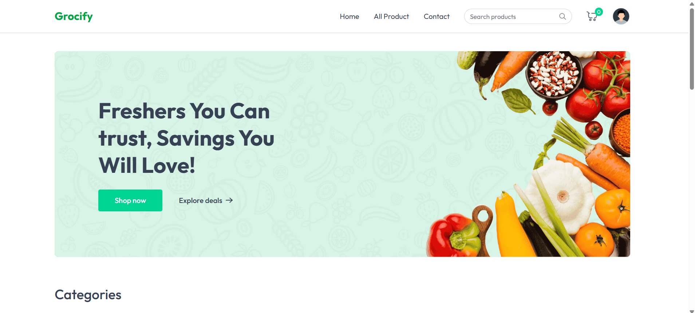
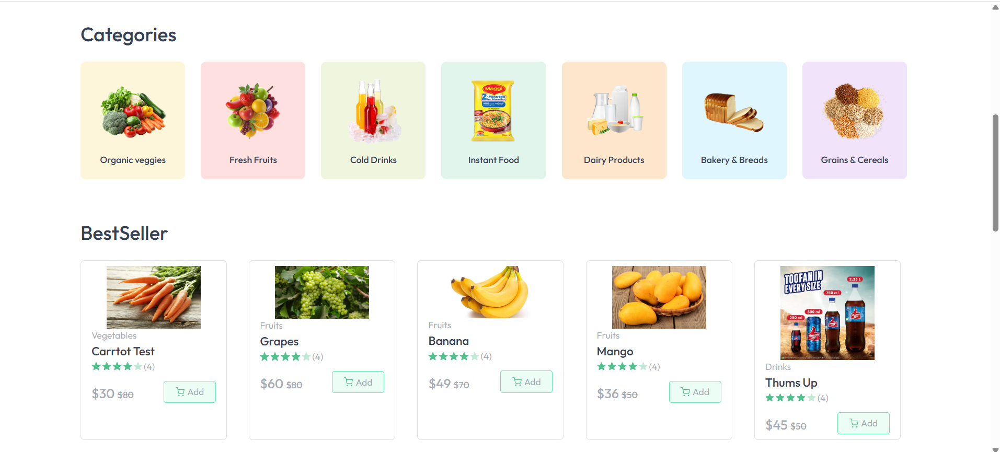
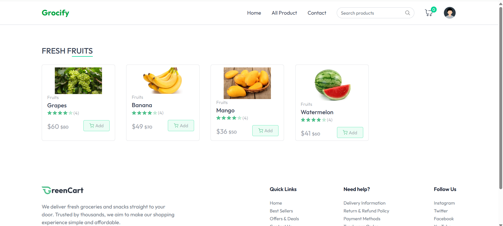
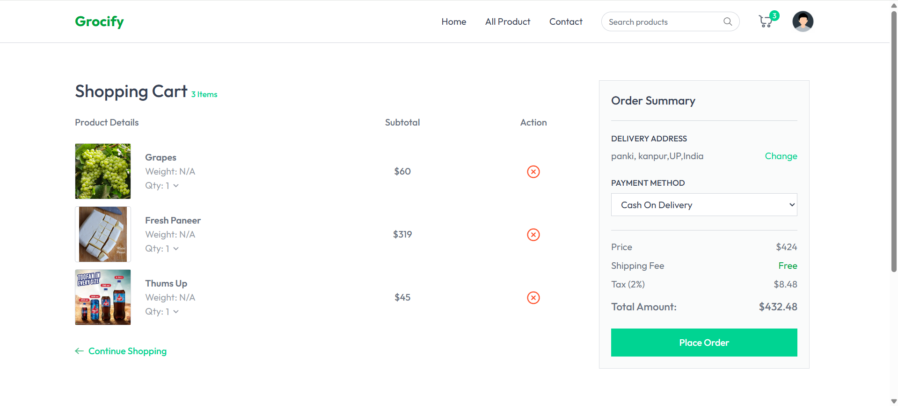

# 🛒 Grocify – Grocery Delivery Web Application

**Grocify** is a full-stack grocery delivery website that offers a seamless shopping experience for food and beverages. The platform allows users to browse a wide range of products, manage their cart, and place orders with flexible payment options — including secure online payments via Razorpay and offline Cash on Delivery.

---

## 🌟 Features

- 🔐 **User Authentication**: Secure login system for customers.
- 🛍️ **Product Catalog**: Browse various food and beverage items by category.
- 🛒 **Smart Cart System**:
  - Add items to cart with a single click.
  - View cart with real-time updates on quantity and pricing.
- 🔍 **Product Details View**: Click on any item to view its detailed information.
- 📦 **Checkout Process**:
  - Enter personal details: name, address, contact number.
  - Choose payment method: **Online (via Razorpay)** or **Offline (Cash on Delivery)**.
- 💳 **Razorpay Integration**:
  - Secure online payments using card details.
  - Fully functional in test mode.
- 📬 **Order Confirmation**:
  - After payment, the user can safely exit the website.
  - Offline orders are marked for Cash on Delivery.

---

## 🛠️ Tech Stack

| Technology    | Description                     |
|---------------|---------------------------------|
| **Frontend**  | HTML, CSS, Bootstrap, JavaScript, React.js |
| **Backend**   | Node.js, Express.js             |
| **Database**  | MongoDB                         |
| **Payment**   | Razorpay (Test Mode Integration) |
| **Tools**     | VS Code, Postman, Git/GitHub    |

---

## 📷 Screenshots

> _Include screenshots here by uploading image files or using Markdown image links like:_

## 👩‍💻 Author

- **Name:** Ishita
- **GitHub:** [@Ishita0817](https://github.com/Ishita0817)
